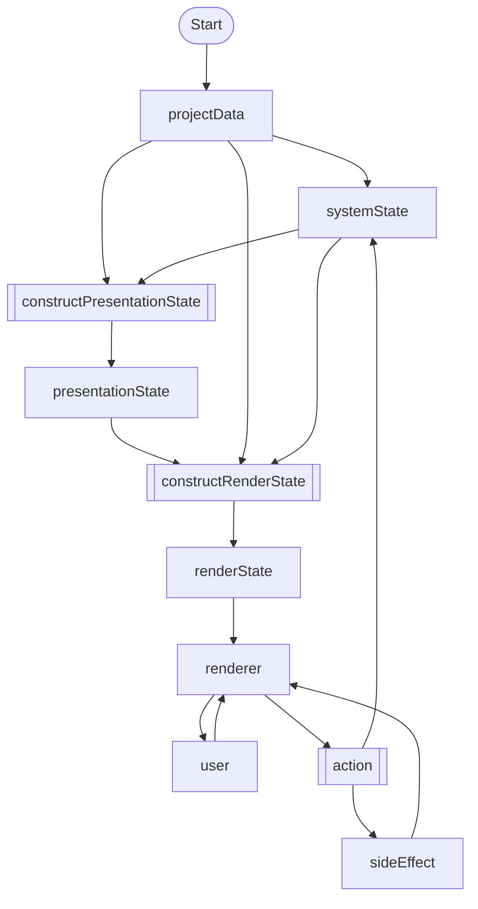

# Route Engine Concepts

route-engine is a state-driven visual novel engine that follows a unidirectional data flow architecture.

## Core Pattern: Unidirectional Data Flow

The engine follows a strict **State → View → Action** cycle:

```
┌─────────────────────────────────────────────────────────────┐
│                                                             │
│   ┌──────────────┐    ┌──────────────┐    ┌─────────────┐  │
│   │    State     │───▶│     View     │───▶│   Action    │  │
│   │ (systemState)│    │(route-graphics)   │   (events)  │  │
│   └──────────────┘    └──────────────┘    └─────────────┘  │
│          ▲                                       │          │
│          │                                       │          │
│          └───────────────────────────────────────┘          │
│                    systemStore actions                      │
│                    update the state                         │
└─────────────────────────────────────────────────────────────┘
```

1. **State (systemState)**: The single source of truth. Contains all runtime data including pointers, variables, and configuration.

2. **View (route-graphics)**: Renders the current state. The view is a pure function of state - given the same state, it always produces the same output.

3. **Action/Events**: User interactions (clicks, key presses) or system events (timers) trigger actions. Actions are processed by systemStore action functions.

4. **systemStore Actions**: These functions receive the current state, apply mutations (via Immer), and produce the next state. The cycle then repeats.

This pattern ensures:
- **Predictability**: State changes only through defined actions
- **Debuggability**: You can inspect any state and understand what the view should show
- **Testability**: Each part can be tested in isolation

## Architecture Overview



## Core Data Structures

### Project Data

Static, read-only data that defines the visual novel content:

- **l10n**: Localization packages for multi-language support
- **resources**: Images, audio, animations, transforms, layouts, characters
- **story**: Scenes, sections, and lines that define the narrative flow

Project data is loaded once and never mutated during runtime.

### System State

Mutable runtime state managed by the system store. Key components:

- **global**: Application-wide settings
  - `pendingEffects`: Queue of side effects to execute
  - `autoMode` / `skipMode`: Playback mode flags
  - `dialogueUIHidden`: UI visibility toggle
  - `currentLocalizationPackageId`: Active language
  - `viewedRegistry`: Tracks which sections/lines have been seen
  - `nextLineConfig`: Controls line advancement behavior
  - `saveSlots`: Save game data
  - `isLineCompleted`: Whether current line animation finished

- **contexts**: Stack of isolated game contexts (supports title screen, gameplay, replays)
  - `currentPointerMode`: Either `'read'` or `'history'`
  - `pointers`: Position trackers (read pointer and history pointer)
  - `historySequence`: Navigation history
  - `configuration`: Context-specific settings
  - `views`: Layered view stack
  - `bgm`: Current background music
  - `variables`: Game variables

### Presentation State

Derived state computed from project data and system state. Represents **what should be displayed** without rendering specifics.

```js
const presentationState = constructPresentationState(presentations);
```

Presentation state includes:
- `base`: Base layout/screen configuration
- `background`: Current background or CG
- `dialogue`: Speaker, text content, mode (ADV/NVL)
- `character`: Character sprites and positions
- `visual`: Additional visual elements
- `bgm` / `sfx` / `voice`: Audio configuration
- `animation`: Active animations
- `layout`: UI layouts
- `choice`: Choice menu data

### Render State

Final output format ready for the renderer:

```js
const renderState = constructRenderState({
  presentationState,
  resources,
  l10n
});
```

Render state structure:
- `elements`: Tree of renderable elements (containers, sprites, text)
- `animations`: Tween animations to apply
- `audio`: Sound effects and music to play

## Contexts

Contexts provide isolated environments for different game states:

- **Title Screen Context**: The main menu before starting a game
- **Gameplay Context**: Active game session (new game or loaded save)
- **Replay Context**: History replay mode with read-only global variables

All contexts share global state but maintain their own:
- Pointer positions
- History sequences
- Variables
- View stacks

## Pointers

Pointers are the core navigation mechanism in route-engine. A pointer tracks the current position in the story by referencing a `sectionId` and `lineId`.

### Pointer Structure

```js
pointer: {
  sectionId: 'chapter_1_intro',
  lineId: 'line_42'
}
```

The pointer always points to a specific line within a specific section. The engine uses this to:
- Retrieve the current line's content and actions
- Determine which lines to include in presentation state (all lines from start of section up to current line)
- Navigate forward/backward through the story

### How Navigation Works

When `nextLine` is executed:
1. Get the current pointer's `sectionId` and `lineId`
2. Find the section using `selectSection({ sectionId })`
3. Find the current line's index in `section.lines`
4. Move to `lines[currentIndex + 1]`
5. Update the pointer with the new `lineId`

```js
// Simplified nextLine logic
const section = selectSection({ sectionId });
const currentIndex = section.lines.findIndex(line => line.id === lineId);
const nextLine = section.lines[currentIndex + 1];
pointer.lineId = nextLine.id;
```

### Pointer Modes

Each context maintains two pointers with different purposes:

```js
pointers: {
  read: { sectionId: '...', lineId: '...' },    // Current playback position
  history: { sectionId: '...', lineId: '...' }  // History review position
}
```

**Read Mode (`'read'`)**
- Normal playback mode
- The read pointer advances through lines sequentially
- Used during active gameplay

**History Mode (`'history'`)**
- Review mode for navigating back through previously viewed content
- Uses a separate history pointer while preserving the read pointer position
- Allows players to re-read past dialogue without losing their place
- Switching back to read mode returns to the preserved read pointer position

## Line Navigation

### Manual Navigation
- Controlled by `nextLineConfig.manual`
- `enabled`: Whether manual advancement is allowed
- `requireLineCompleted`: Whether line must finish animating first

### Auto Navigation
- Controlled by `nextLineConfig.auto`
- `enabled`: Whether auto-advance is active
- `trigger`: When to advance (`'fromStart'` or `'fromComplete'`)
- `delay`: Milliseconds to wait before advancing

## Dialogue Modes

### ADV Mode (Adventure)
Traditional visual novel style with one text box showing the current line. Each new line replaces the previous content.

### NVL Mode (Novel)
Novel-style display where lines accumulate on screen. Text is appended rather than replaced.

## Actions and Effects

### Actions
Functions that mutate system state. Examples:
- `nextLine`: Advance to next line
- `prevLine`: Go back in history
- `sectionTransition`: Jump to a different section
- `jumpToLine`: Jump to specific line
- `toggleAutoMode` / `toggleSkipMode`: Control playback
- `toggleDialogueUI`: Show/hide dialogue box

### Pending Effects
Side effects queued during action execution:
- `render`: Re-render the current state
- `handleLineActions`: Process actions attached to a line
- `startAutoNextTimer` / `clearAutoNextTimer`: Auto mode timers
- `startSkipNextTimer` / `clearSkipNextTimer`: Skip mode timers

## Store Architecture

The engine uses a custom store implementation (`createStore`) with:

- **Selectors**: Pure functions starting with `select*` that read state
- **Actions**: Functions that mutate state via Immer

```js
const store = createStore(initialState, {
  selectCount: (state) => state.count,
  increment: (state) => { state.count++; }
});
```

### Action Executors

Two patterns for processing multiple actions:

**Sequential Executor**: Applies all actions to each payload in sequence
```js
const executor = createSequentialActionsExecutor(createInitialState, actions);
const result = executor(payloads);
```

**Selective Executor**: Applies only specified actions with their payloads
```js
const executor = createSelectiveActionsExecutor(deps, actions, createInitialState);
const result = executor({ actionName: payload });
```

## Viewed Registry

Tracks content the player has seen:

- **sections**: Array of `{ sectionId, lastLineId }` entries
- **resources**: Array of `{ resourceId }` entries

Used for:
- Skip mode (skip only viewed content)
- Unlocking gallery items
- Tracking completion progress

## Save System

Save slots store:
- `slotKey`: Unique identifier
- `date`: Unix timestamp
- `image`: Screenshot (base64)
- `state`: Serialized game state
