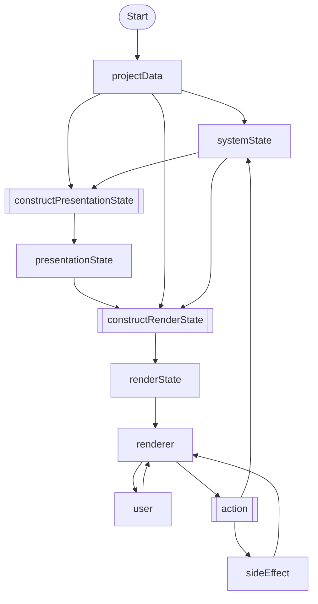

# Route Engine Concepts

route-engine is a state-driven visual novel engine that follows a unidirectional data flow architecture.

## Core Pattern: Unidirectional Data Flow

The engine follows a strict **State → View → Action** cycle:

```
┌─────────────────────────────────────────────────────────────┐
│                                                             │
│   ┌──────────────┐    ┌──────────────┐    ┌─────────────┐  │
│   │    State     │───▶│     View     │───▶│   Action    │  │
│   │ (systemState)│    │(route-graphics)   │   (events)  │  │
│   └──────────────┘    └──────────────┘    └─────────────┘  │
│          ▲                                       │          │
│          │                                       │          │
│          └───────────────────────────────────────┘          │
│                    systemStore actions                      │
│                    update the state                         │
└─────────────────────────────────────────────────────────────┘
```

1. **State (systemState)**: The single source of truth. Contains all runtime data including pointers, variables, and configuration.

2. **View (route-graphics)**: Renders the current state. The view is a pure function of state - given the same state, it always produces the same output.

3. **Action/Events**: User interactions (clicks, key presses) or system events (timers) trigger actions. Actions are processed by systemStore action functions.

4. **systemStore Actions**: These functions receive the current state, apply mutations (via Immer), and produce the next state. The cycle then repeats.

This pattern ensures:

- **Predictability**: State changes only through defined actions
- **Debuggability**: You can inspect any state and understand what the view should show
- **Testability**: Each part can be tested in isolation

## Architecture Overview


```mermaid
flowchart TD
    Start([Start]) --> projectData[projectData]
    projectData --> systemState[systemState]

    projectData --> constructPresentationState[[constructPresentationState]]
    systemState --> constructPresentationState
    constructPresentationState --> presentationState[presentationState]

    presentationState --> constructRenderState[[constructRenderState]]
    projectData --> constructRenderState
    systemState --> constructRenderState
    constructRenderState --> renderState[renderState]

    renderState --> renderer[renderer]
    user[user] --> renderer
    renderer --> user
    renderer --> action[[action]]
    action --> sideEffect[sideEffect]
    action --> systemState
    sideEffect --> renderer
```

## Core Data Structures

### Project Data

Static, read-only data that defines the visual novel content:

- **resources**: Images, audio, animations, transforms, layouts, characters, fonts, colors, and `textStyles`
  - Localization is not implemented in the current runtime. The planned patch-based model is documented in `docs/L10n.md`
  - Layout text elements should reference shared styles with `textStyleId`
  - `resources.colors[*].hex` should be opaque hex only; text fill and stroke transparency should be authored on `resources.textStyles` with `colorAlpha` / `strokeAlpha`, not inside `resources.colors`
  - Layout sprite elements should reference images with `imageId` and optional `hoverImageId` / `clickImageId`
  - Layout rect elements should reference shared colors with `colorId` and optional `hover.colorId` / `click.colorId` / `rightClick.colorId`
  - Authored inline `textStyle` objects, authored sprite `src` / `hover.src` / `click.src` fields, and authored rect `fill` / `hover.fill` / `click.fill` / `rightClick.fill` fields in layout elements are invalid and fail fast at render-state construction
- **story**: Scenes, sections, and lines that define the narrative flow
  - Scene containers remain part of authored story structure
  - Section IDs are globally unique across scenes and are the primary runtime routing key

Project data is loaded once and never mutated during runtime.

### System State

Mutable runtime state managed by the system store. Key components:

- **global**: Application-wide settings
  - `pendingEffects`: Queue of side effects to execute
  - `autoMode` / `skipMode`: Playback mode flags
  - `dialogueUIHidden`: UI visibility toggle
  - `accountViewedRegistry`: Account-level seen registry used by skip-unseen checks
  - `nextLineConfig`: Controls line advancement behavior
  - `saveSlots`: Save game data
  - `isLineCompleted`: Whether current line animation finished

- **contexts**: Stack of isolated game contexts (supports title screen, gameplay, replays)
  - `currentPointerMode`: Always `'read'`
  - `pointers`: Position tracker for the active read location
  - `configuration`: Context-specific settings
  - `views`: Overlay stack
  - `bgm`: Current background music
  - `variables`: Game variables
  - `rollback`: Active branch timeline for rollback navigation

### History and Seen State

The engine has separate concepts that should not be collapsed:

- `historyDialogue`: A render-time dialogue backlog projection for the current section. It is used by layouts and does not restore state.
- `context.rollback.timeline`: The active path for rollback navigation in the current context. It crosses sections and is saved with slots, but abandoned future checkpoints are removed when the player rolls back and branches.
- `global.accountViewedRegistry`: The account-level seen snapshot. It is persisted outside slots and is not replaced by `loadSlot`.

`runtime.skipUnseenText` is a device-level preference. The seen data it checks is account-level: skip-unseen uses `global.accountViewedRegistry`, not save slots or `rollback.timeline`.

### Presentation State

Derived state computed from project data and system state. Represents **what should be displayed** without rendering specifics.

```js
const presentationState = constructPresentationState(presentations);
```

Presentation state includes:

- `background`: Current background or CG
- `dialogue`: Speaker, text content, mode (ADV/NVL)
- `character`: Character sprites and positions
- `visual`: Additional visual elements
- `bgm` / `sfx` / `voice`: Audio configuration
- `animation`: Active animations
- `layout`: UI layouts
- `choice`: Choice menu data

### Render State

Final output format ready for the renderer:

```js
const renderState = constructRenderState({
  presentationState,
  resources,
});
```

Render state structure:

- `elements`: Tree of renderable elements (containers, sprites, text)
- `animations`: Renderer animation descriptors to apply
- `audio`: Sound effects and music to play

## Contexts

Contexts provide isolated environments for different game states:

- **Title Screen Context**: The main menu before starting a game
- **Gameplay Context**: Active game session (new game or loaded save)
- **Replay Context**: History replay mode with read-only global variables

All contexts share global state but maintain their own:

- Pointer positions
- Rollback timelines
- Variables
- View stacks

## Pointers

Pointers are the core navigation mechanism in route-engine. A pointer tracks the current position in the story by referencing a `sectionId` and `lineId`.
Section IDs are globally unique, so section lookup is scene-agnostic at runtime even though scenes still exist in authored project data.

### Pointer Structure

```js
pointer: {
  sectionId: 'chapter_1_intro',
  lineId: 'line_42'
}
```

Some runtime paths may also carry `sceneId` as additional metadata, but the
authoritative lookup key is the globally unique `sectionId`.

The pointer always points to a specific line within a specific section. The engine uses this to:

- Retrieve the current line's content and actions
- Determine which lines to include in presentation state (all lines from start of section up to current line)
- Navigate forward/backward through the story

### How Navigation Works

When `nextLine` is executed:

1. Get the current pointer's `sectionId` and `lineId`
2. Find the section using `selectSection({ sectionId })`
3. Find the current line's index in `section.lines`
4. Move to `lines[currentIndex + 1]`
5. Update the pointer with the new `lineId`

```js
// Simplified nextLine logic
const section = selectSection({ sectionId });
const currentIndex = section.lines.findIndex((line) => line.id === lineId);
const nextLine = section.lines[currentIndex + 1];
pointer.lineId = nextLine.id;
```

### Active Pointer

Each context maintains a single active read pointer:

```js
pointers: {
  read: { sectionId: '...', lineId: '...' }
}
```

- The read pointer advances through lines sequentially during gameplay.
- Back navigation is handled by the rollback timeline, not a separate history pointer.

## Line Navigation

### Manual Navigation

- Controlled by `nextLineConfig.manual`
- `enabled`: Whether manual advancement is allowed
- `requireLineCompleted`: Whether line must finish animating first

### Auto Navigation

- Controlled by `nextLineConfig.auto`
- `enabled`: Whether auto-advance is active
- `trigger`: When to advance (`'fromStart'` or `'fromComplete'`)
- `delay`: Milliseconds to wait before advancing

Global playback modes use a different timing model:

- Global `autoMode` starts its delay after the current line is completed.
- In practice, completion is driven by Route Graphics `renderComplete`, so text reveal and other tracked render work finish first.
- Global `skipMode` does not wait for completion; it advances aggressively on its own short timer.
- `nextLineConfig.auto` is the only built-in auto-like behavior that can intentionally start from line start via `trigger: "fromStart"`.

## Dialogue Modes

### ADV Mode (Adventure)

Traditional visual novel style with one text box showing the current line. Each new line replaces the previous content.

### NVL Mode (Novel)

Novel-style display where lines accumulate on screen. Text is appended rather than replaced.

## Actions and Effects

### Actions

Functions that mutate system state. Examples:

- `nextLine`: Advance to next line
- `rollbackByOffset`: Go back through rollback checkpoints
- `sectionTransition`: Jump to a different section
- `jumpToLine`: Jump to specific line
- `toggleAutoMode` / `toggleSkipMode`: Control playback
- `toggleDialogueUI`: Show/hide dialogue box

### Pending Effects

Side effects queued during action execution:

- `render`: Re-render the current state
- `handleLineActions`: Process actions attached to a line
- `startAutoNextTimer` / `clearAutoNextTimer`: Auto mode timers
- `startSkipNextTimer` / `clearSkipNextTimer`: Skip mode timers
- `nextLineConfigTimer` / `clearNextLineConfigTimer`: Authored next-line timers

The built-in `createEffectsHandler(...)` coalesces only the latest occurrence of replaceable built-in effects such as `render`, timer effects, line-action dispatch, and persistence effects. Custom effect names are preserved and must be handled explicitly.

## Store Architecture

The engine uses a custom store implementation (`createStore`) with:

- **Selectors**: Pure functions starting with `select*` that read state
- **Actions**: Functions that mutate state via Immer

```js
const store = createStore(initialState, {
  selectCount: (state) => state.count,
  increment: (state) => {
    state.count++;
  },
});
```

### Action Executors

Two patterns for processing multiple actions:

**Sequential Executor**: Applies all actions to each payload in sequence

```js
const executor = createSequentialActionsExecutor(createInitialState, actions);
const result = executor(payloads);
```

**Selective Executor**: Applies only specified actions with their payloads

```js
const executor = createSelectiveActionsExecutor(
  deps,
  actions,
  createInitialState,
);
const result = executor({ actionName: payload });
```

## Viewed Registry

Tracks content the player has seen:

- **sections**: Array of `{ sectionId, lastLineId }` entries
- **resources**: Array of `{ resourceId }` entries

For lines, this is intentionally a section-level frontier model:

- `lastLineId` means the furthest seen line reached within that section.
- Any line at or before that frontier is treated as seen.
- This assumes section flow is effectively linear, which matches the engine's current use of seen-lines for skip behavior and progress tracking.

The frontier is updated when the current line is completed and also when advancing away from the current line. That keeps the final completed line in a section marked as seen even if there is no later line to move to.

Used for:

- Skip mode (skip only viewed content)
- Unlocking gallery items
- Tracking completion progress

## Save System

Save slots store:

- `slotId`: Unique identifier
- `savedAt`: Unix timestamp
- `image`: Screenshot (base64)
- `state`: Serialized game state
