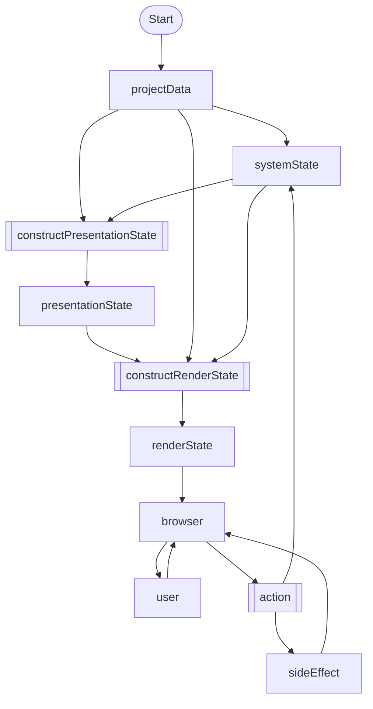

# System State Machine



## Project Data

This is contains all the content of the Visual Novel. Including:
- i18n: content and translations
- resources: including images, audio, UI etc...
- story: scenes, sections, lines

This data is static, meaning that it is loaded into the engine and never changes. is read only.

## System State

This is internal runtime state of the Visual Novel. This data is mutable.

The state is only mutable via system actions

Example of what system state includes is:
- current scene, section, line
- whether to hide dialogue box
- variables


## System Actions

System actions can generate 2 things:

- mutations to the system state
- side effects

Side effects include things like: storing variables, storing save data, taking screenshots etc..
Render the screen with the latest Render Data is also a side effect.

## Presentation State

```js
const presentatioState = constructPresentationState(projectData, systemState);
```

Presentation data gives critical information on what should be displayed.
It works by iterating through lines of a section.

## Render State

```js
const renderState = constructRenderState(projectData, systemState, presentationState);
```

Render state in `route-graphics`. It is a format that is directly rendered into the browser.


